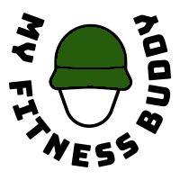
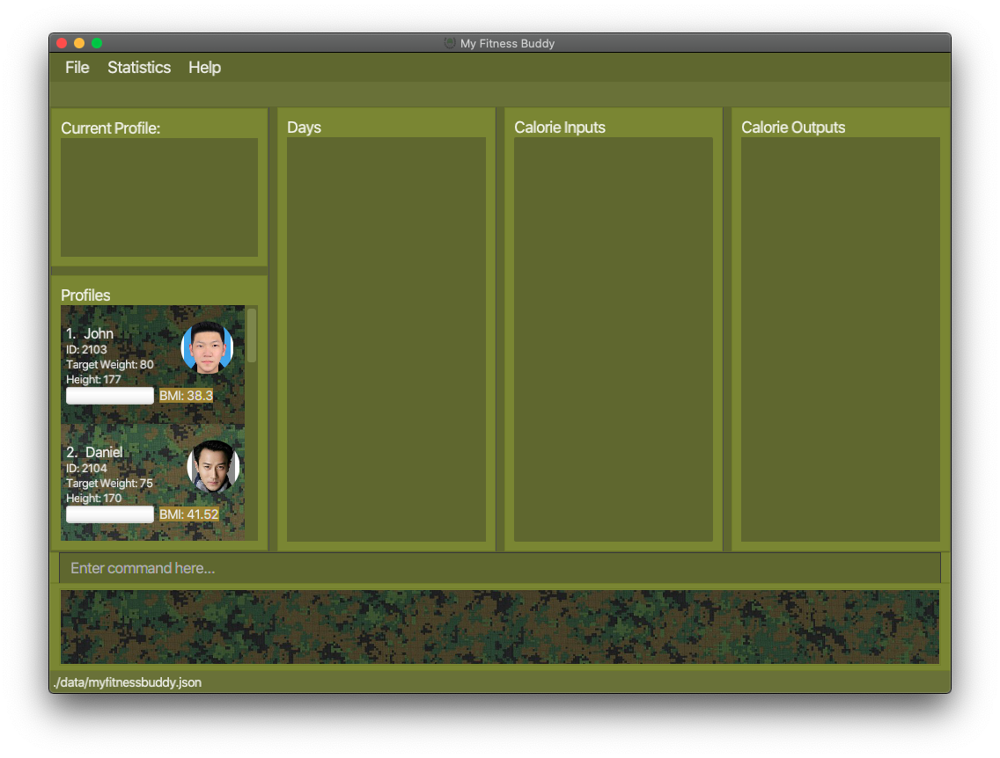
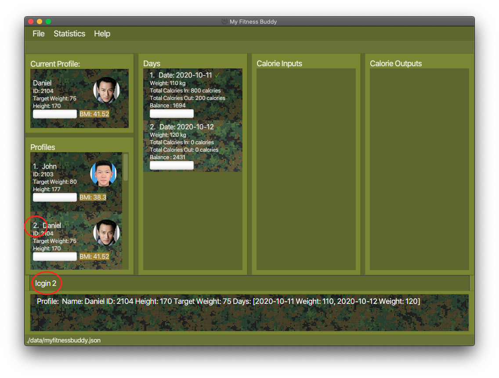
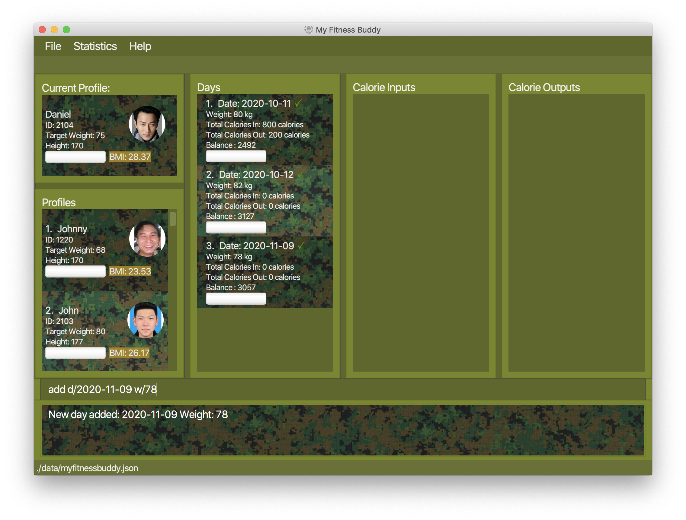
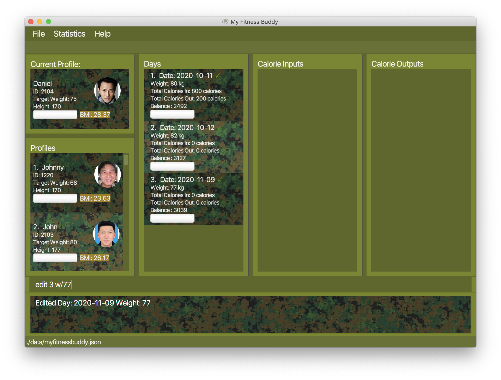
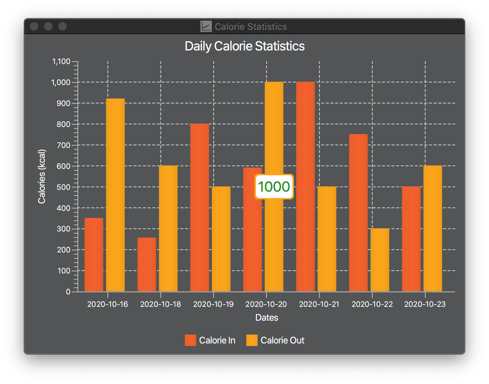
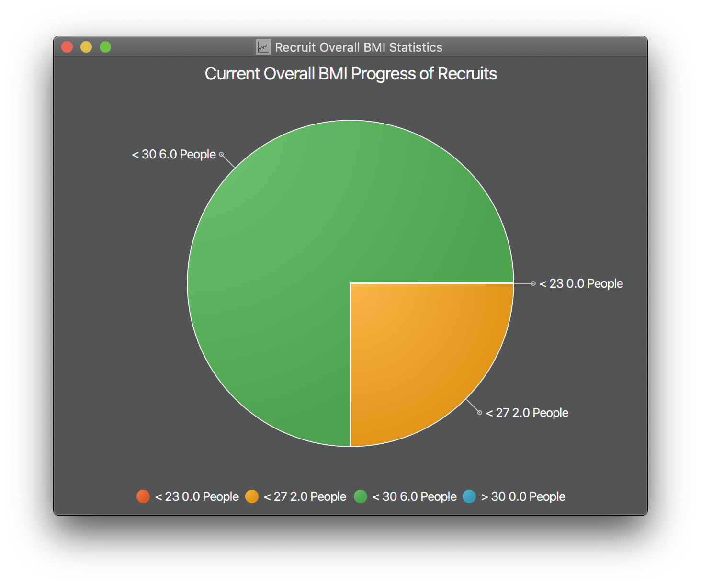
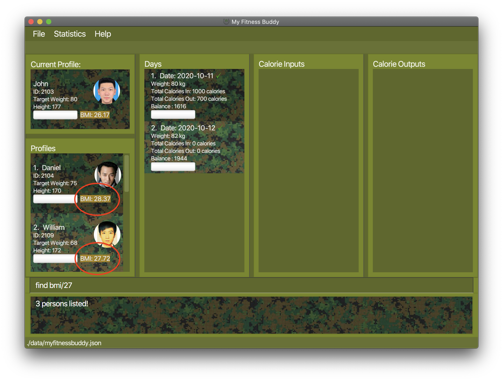

   
   
Welcome to My Fitness Buddy User Guide!  

Just enlisted under PES ‘B’ Pending and worried about the next few months of Basic Military Training (BMT)?  
Worry no more, My Fitness Buddy is here to accompany you through BMT and help you keep track of your weight loss journey!  
This user guide serves to provide you with the necessary instructions on how to set up and use our application. With that said, let’s get started!    

Choose a topic from the [Table of Contents](#table-of-contents) below.

## Table of Contents
* Table of Contents
{:toc}  

--------------------------------------------------------------------------------------------------------------------

## 1. Introduction
### 1.1 Application Overview
My Fitness Buddy `v1.4` is a desktop application that helps you to track your overall change in fitness level by allowing you to add daily records of your weight and calorie input/output.  
My Fitness Buddy also allows users to create a profile and can generate visual charts based on these records so that you can monitor your daily progress and help you achieve your goals.  
This application is optimized for use through a *Command Line Interface (CLI)*, meaning that you operate the application by typing commands into a command box.

### 1.2 Target Audience
My Fitness Buddy is designed for PES ‘B’ Pending (BP) soldiers who have just enlisted and are starting their initial 10 weeks of fitness training in BMT. Our features revolve around providing a visual and convenient way to keep track of factors that affect weight loss.

### 1.3 Rationale
 Before this application was developed, PES BP soldiers had weekly weighing and had to record down their weights on a form kept by their commanders. This method was not only time consuming, it was also ineffective in tracking the soldiers' overall fitness levels. For instance, if a soldier's weight did not decrease over the weeks, he would be unable to pinpoint the reason why this is so.   
 My Fitness Buddy was developed so that soldiers would be able to see the fluctuations in their fitness level through factors such as calorie intake from consumption, calorie output from exercise, and daily weight records. Those records would be available by day and can even be viewed as  a graph.  
 We hope that through the use of this application, soldiers can take charge of their own fitness and achieve the results they strive for. 

--------------------------------------------------------------------------------------------------------------------
## 2. About
### 2.1 Using this User Guide
This User Guide has been structured such that users can easily find and understand what they need.
[Section 2](#2-about) contains useful tips and information on reading this document.
[Section 3](#3-getting-started) consists of instructions to set up this application
[Section 4](#4-features) includes the details of the 4 main features of My Fitness Buddy which are
* Profile page
* List of days
* Calorie input and output
* Statistics

### 2.2 Symbols and Syntax
The table below explains the general symbols and syntax used throughout the document.

Symbol/syntax | Meaning
--------|------------------
`command` | This indicates a command to be entered into the input box. More information can be found at [Command Format](#23-command-format).
:bulb: | This indicates a tip.
:warning: | This indicates a warning.

### 2.3 Command Format
Commands are used to tell My Fitness Buddy to perform specific tasks.  
All commands in the following sections follow the same format.
* Words in `UPPER_CASE` are the parameters to be supplied by the user.
	* Example: in `add d/DATE w/WEIGHT`, `DATE` and `WEIGHT` are parameters to be replaced by the user. 
	 e.g. `add d/2020-10-25 w/70`
	
--------------------------------------------------------------------------------------------------------------------

## 3. Getting Started
(Contributed by Jun Hui)

Thank you for using My Fitness Buddy! Here's a quick start guide to get you started.

1. Ensure you have Java 11 or above installed in your Computer.

1. Download the latest *MyFitnessBuddy_`v1.4`*.jar [here](https://github.com/AY2021S1-CS2103T-W11-3/tp/releases)

1. Copy the file to the folder you want to use as the *home folder* for My Fitness Buddy. 
 
1. Double-click the file to start the app. The GUI similar to the below should appear in a few seconds.
          
         
1. If the app doesn’t start right away, try opening a command terminal in the folder and enter  
`java -jar MyFitnessBuddy_v1.4.jar`

1. You can type a command in the command box and press <kbd>Enter</kbd> to execute it. 
    Here are some basic commands you can try:
    * `login 1` : Loads the first profile in the profile list.
    * `add d/2020-10-16 w/70`: Creates a daily record with the specified date and weight.
    * `calorie d/2020-10-26 tp/in t/1200 f/laksa c/290`: Adds a calorie input entry with the specified date.
    * `stats v/all`: View both calorie and weight charts in a pop-up window.

1. Head to [Features](#4-features) below to learn more details of each command. 

--------------------------------------------------------------------------------------------------------------------

## 4. Features
(Contributed by Jun Hui)

:warning: **WARNING:** Commands from section [#4.1.2](#411-creating-a-new-profile--create) to
                       [#4.4.1](#441-view-all-calorie-inputs-and-outputs-of-a-day-view) REQUIRES you to `login` to a profile first.
                        You can login to a profile using `login INDEX`, where `INDEX` is the index number of the profile in the Profile List Panel.

### 4.1 Profile commands

Commands in this section are useful for allowing multiple users to use this app. 
Multiple users can create their own profiles and add their own records to it.  

#### 4.1.1 Creating a new profile : `create`
Create a new profile for a new Person.

Format: `create n/NAME id/ID_NUM h/HEIGHT w/TARGET_WEIGHT`

:warning: For valid ID_NUM, the first two digits must be from 1 - 4, 
while the last two digits must be from 1 - 20. A valid ID_NUM has only four digits. 

Examples:  
`create n/Johnny id/1220 h/170 w/68` 

Meaning: create a new profile with name Johnny, ID number 1220, height 170cm and target weight of 68kg.

#### 4.1.2 Editing an existing profile: `update`
update an existing profile.

Format: `update [optional] n/NAME id/ID_NUM h/HEIGHT w/TARGET_WEIGHT`

Examples:
`update n/Jonhhy`

Meaning:`update the name of current profile that you are looking to Johnny`

Warning:`must update at least one of the field and it cannot be the same as the current one`

#### 4.1.3 viewing another profile: `login`
Changes the profile that you are currently looking at to another profile

Format: `update [index]`

Examples:
`login 2`

Meaning:`changes the current profile that you are looking at to the profile in the profile list with an index of 2`

### 4.2 Day commands
Commands in this section are useful in tracking of daily weight records. You should use these commands to log your weight for 
a new day before adding calorie related information and edit your weight if you made a mistake. 

#### 4.2.1 Adding a daily weight record : `add d/DATE w/WEIGHT`
Adds a new daily weight record.

Format: `add d/DATE w/WEIGHT`

Example:  
`add d/2020-10-29 w/72` 

Meaning:
Adds a new day, 29 October 2020, with a weight of 72kg.

_TIP: Always add a day before adding a calorie information. `DATE` has to be in the YYYY-MM-DD format._

#### 4.2.2 Editing a daily weight record : `edit INDEX w/WEIGHT`
Edits a daily weight record.

Format: `edit INDEX w/WEIGHT`

Example:  
`edit 3 w/70` 

Meaning:
Edits a day at index 3 with a new weight of 70kg.

_TIP: `WEIGHT` should be in KG._

#### 4.2.3 Deleting a daily record: `delete INDEX`
Deletes a daily record at INDEX.

Format: `delete INDEX`

Example:
`delete 2`

Meaning:
Deletes a day at index 2.

### 4.3 Calorie Commands
Commands in this section are useful in keeping track of the various calorie content.
You can use them to log different kinds of calorie content and their relevant information.

There are two main types of calorie that you can keep of : Input and Output
Calorie.

Each of them consist of three main components as summarized below.

INPUT CALORIE | OUTPUT CALORIE
--------------|---------------
tp/in         |tp/out
t/            |t/
f/            |e/
c/            |c/

The table below summarizes the various prefix relevant for this section
and their corresponding meaning.

Prefix | Meaning
--------|------------------
**tp/** | `type of calorie`
**t/** | `time`
**f/** | `food`
**e/** | `exercise`
**c/** | `calorie count`
**i/** | `index`
**d/** | `date`

#### 4.3.1 Adding Calorie
##### 4.3.1.1 Adding a calorie input : `calorie tp/in`

Add calorie input to the calorie tracker.

Format: `calorie tp/in d/DATE t/TIME f/FOOD c/CALORIE COUNT`

Examples:`calorie d/2020-10-26 tp/in t/1200 f/laksa c/290` 

Meaning:`The user ate laksa with the calorie count of 290kcal at 12pm on the date October 26 2020` 

_TIP: If the `DATE` field is left empty, the calorie input will be added to the current date entry._

##### 4.3.1.2 Adding a calorie output : `calorie tp/out`
Add calorie output to the calorie tracker.

Format: `calorie tp/out d/DATE t/TIME e/EXERCISE c/CALORIE COUNT`

Examples:`calorie d/2020-10-26 tp/in t/1200 e/running c/400` 

Meaning:`The user ran on October 26 2020 at 12pm and has expanded 400kcal` 

_TIP: If the `DATE` field is left empty, the calorie output will be added to the current date entry._

#### 4.3.2 Removing Calorie
##### 4.3.2.1 Removing a calorie input : `remove tp/in`

Removes a wrong calorie input entry from the calorie tracker.

Format: `remove tp/in d/DATE i/INDEX`

Examples:`remove tp/in d/2020-10-26 i/3` 

Meaning:`Remove a calorie input from October 26 2020 calorie log, which is the 3rd calorie input in the list of
Input calories for that day.` 

_TIP: Instead of using d/DATE to specify the date of the log in which the calorie belongs too, the index of the date
can be used instead_

Example:`remove 3 tp/in i/3` 

##### 4.3.2.2 Removing a calorie output : `remove tp/out`

Removes a wrong calorie Output entry from the calorie tracker.

Format: `remove tp/out d/DATE i/INDEX`

Examples:`remove tp/in d/2020-10-26 i/3` 

Meaning:`Remove a calorie output from October 26 2020 calorie log, which is the 3rd calorie output in the list of
Output calories for that day.` 

_TIP: Instead of using d/DATE to specify the date of the log in which the calorie belongs too, the index of the date
can be used instead_

Examples:`remove 3 tp/out i/3` 

#### 4.3.3 Modifying Calorie
##### 4.3.3.1 Modifying a calorie input : `modify tp/in`

Modify a calorie input entry with details recorded wrongly

Format: `modify d/DATE tp/in i/INDEX [Updated Details]`

Examples:`modify d/2020-10-26 tp/in i/2 c/123` 

Meaning:`change the calorie count of an input calorie in the log from October 26 2020 with the index of 2 in the
input list to 123` 

`Input[ Time:... Food:... CalorieCount: 9000` ]--after modification-->  `Input:[ Time:... Food:... CalorieCount: 123 ]`

_TIP: Instead of using d/DATE to specify the date of the log in which the calorie belongs too, the index of the date
can be used instead_
Examples:`modify 3 tp/out i/3 c/123`

##### 4.3.3.2 Modifying a calorie output : `modify tp/out`

Modify a calorie out entry with details recorded wrongly

Format: `modify d/DATE tp/in i/INDEX [Updated Details]`

Examples:`modify d/2020-10-26 tp/in i/2 c/123` 

Meaning:`change the calorie count of an Output calorie in the October 26 2020 log ,with the index of 2 in the
output list to 123` 

`Input[ Time:... Exercise:... CalorieCount: 9000` ]--after modification-->  `Input:[ Time:... Exercise:... CalorieCount: 123 ]`

_TIP: Instead of using d/DATE to specify the date of the log in which the calorie belongs too, the index of the date
can be used instead_

### 4.4 Data Visualization
(Contributed by Jun Hui)

Commands in this section are useful to view the graphical representations of the
daily weights and calorie input/output records generated by My Fitness Buddy.

These features help you to monitor your daily progress easily and allows you to understand
certain trends so that you can make better choices during your weight loss journey!

#### 4.4.1 View all calorie inputs and outputs of a day: `view`

Shows a list of all entries of calorie inputs and calorie outputs of a particular day.

Format: `view INDEX`

Main screen when a particular day is viewed:

_:bulb:TIP: Calorie lists can be viewed alternatively by double clicking on a particular day card._

#### 4.4.2 View Statistics: `stats`
(Contributed by Jun Hui)

Shows the charts generated from the daily entries of weight and calorie input/output in a pop-up window.

Format: `stats v/CHART_TO_BE_VIEWED`

You can select which charts to view:

Prefix/Parameter | Meaning
-----------------|------------------
**v/all**        | `Shows both weight and calorie charts`
**v/calorie**    | `Shows calorie chart only`
**v/weight**     | `Shows weight chart only`

Example: `stats v/all`

This command will display both charts in their respective pop-up windows.

_:bulb:TIP: You can hover your mouse over the data point to see the actual value_

Weight Chart:

Calorie Chart:

_:bulb:TIP: Charts can be viewed alternatively by going to the menu bar, click on `Statistics` and select the 
 chart that you want to view._

### 4.5 General commands
(Contributed by Jun Hui)

#### 4.5.1 Viewing help : `help`

Shows a message explaining how to access the help page.

Format: `help`

#### 4.5.2 Clearing all entries : `clear`

|              :warning: :warning: WARNING :warning: :warning:              |
|:--------------------------------------------------------------------------|
| This command will clear all data in My Fitness Buddy, even the saved file!|

Clears all saved entries in MyFitnessBuddy.

Format: `clear`

#### 4.5.3 Exiting the program : `exit`
Exits the program.

Format: `exit`

### 4.6 Additional Features for BMT Commanders
(Contributed by Jun Hui)

Commands in this section are useful for BMT commanders to view the overall progress of 
the recruits.

These features help you to keep track the overall progress of the recruits with the help of
graphical representations, so you and other commanders can have a better insight to your training
effectiveness.

#### 4.6.1 View overall BMI progress of the recruits: `stats v/commander`
Shows a pie chart that classifies all the recruits (with their profiles existing in the app) into different BMI categories.

Format: `stats v/commander`

Pie Chart:

#### 4.6.2 Find recruits that exceeded certain BMI threshold: `find bmi/`
Filters the list in Profile List Panel to show profiles that exceeded the specified BMI threshold.

Format: `find bmi/BMI_VALUE`

Example: `find bmi/27`

Meaning: Filters the list to show profiles that with more than or equal to BMI of 27.

_:bulb:TIP: Use `list` command to show all profiles after executing `find bmi/` command._

### 4.7 Saving the data

My Fitness Buddy data are saved in the hard disk automatically after any command that changes the data. There is no need to save manually.

--------------------------------------------------------------------------------------------------------------------

## 5. FAQ
### 5.1 Transferring Data

**Q**: How do I transfer my data to another Computer? 
**A**: Install the app in the other computer and overwrite the empty data file it creates with the file that contains the data of your previous My Fitness Buddy home folder.  

--------------------------------------------------------------------------------------------------------------------

## 6. Command summary

Action | Format
--------|------------------
**Create profile** | `create n/NAME id/ID_NUM h/HEIGHT w/TARGET_WEIGHT` 
**Edit profile** | `profile edit n/NAME id/ID_NUM h/HEIGHT w/TARGET_WEIGHT`
**Add day record** | `add d/DATE w/WEIGHT` 
**Edit day record** | `edit INDEX w/WEIGHT`
**Delete day record** | `delete INDEX`
**Add input** | `calorie tp/in t/TIME f/FOOD c/CALORIE_COUNT`
**Add output** | `calorie tp/out t/TIME d/DURATION c/CALORIE_BURNT`
**Remove input** | `remove tp/in d/DATE i/INDEX` 
**Remove output** | `remove tp/out d/DATE i/INDEX` 
**Modify input** | `modify tp/in t/TIME f/FOOD c/CALORIE_COUNT`
**Modify output** | `modify tp/out t/TIME d/DURATION c/CALORIE_BURNT` 
**View calories of a day** | `view INDEX`
**View statistics** | `stats v/CHART_TO_BE_VIEWED`
**View overall BMI progress of recruits for commanders** | `stats v/commander`
**Find specific recruits that exceeded BMI threshold** | `find bmi/BMI_VALUE`
**Clear entries** | `clear`
**Help** | `help`
**Exit** | `exit`

